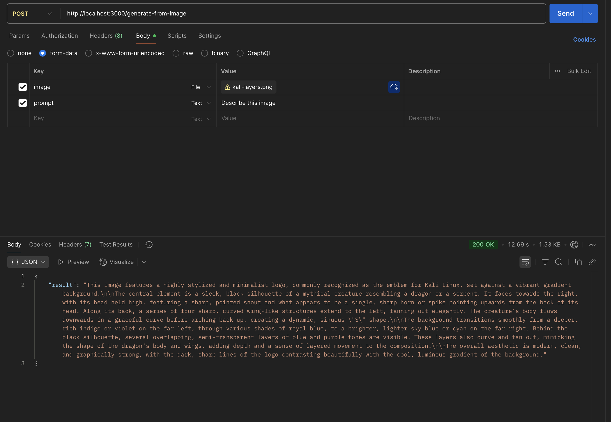

# Gemini Flash API

API sederhana dengan Express + Google Generative AI (`@google/generative-ai`)  
Mendukung **text, image, audio, dan document** input.

---

## 🚀 Setup

1. Clone repo ini
2. Install dependencies:
   ```bash
   npm install
   ```
3. Buat file `.env` isi:
   ```
   GEMINI_API_KEY=your_api_key
   PORT=3000
   ```
4. Jalankan server:
   ```bash
   node index.js
   ```
   Server akan jalan di `http://localhost:3000`

---

## 📌 Endpoints

### 1. Generate Text
**POST** `/generate-text`  
**Body (JSON):**
```json
{
  "prompt": "Tuliskan pantun tentang air PDAM"
}
```

---

### 2. Generate From Image
**POST** `/generate-from-image`  
**Body (form-data):**
- `prompt` (Text, optional)  
- `image` (File)  

---

### 3. Generate From Audio
**POST** `/generate-from-audio`  
**Body (form-data):**
- `prompt` (Text, optional, default: "Transkrip audio berikut:")  
- `audio` (File, contoh: .wav, .mp3)  

---

### 4. Generate From Document
**POST** `/generate-from-document`  
**Body (form-data):**
- `prompt` (Text, optional, default: "Ringkas dokumen berikut:")  
- `document` (File, contoh: .pdf, .docx, .txt)  

---

## 🧪 Contoh Curl

Generate text:
```bash
curl -X POST http://localhost:3000/generate-text \
  -H "Content-Type: application/json" \
  -d '{"prompt":"Halo Gemini, buatkan ringkasan!"}'
```

Upload image:
```bash
curl -X POST http://localhost:3000/generate-from-image \
  -F "prompt=Describe this image" \
  -F "image=@/path/to/file.png"
```

---

## 📸 Screenshots

Tampilan hasil uji coba API dengan Postman:

### Generate Text


### Generate From Image


### Generate From Audio


### Generate From Document


---

## ⚡ Catatan
- Pastikan API key valid (`GEMINI_API_KEY`).  
- Default model: `gemini-2.5-flash` (bisa diganti di `index.js`).  
- Error handling akan mengembalikan JSON:  
  ```json
  { "error": "message" }
  ```
